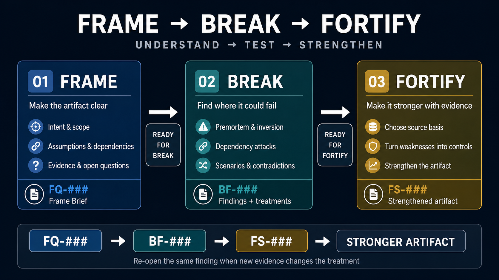

# Frame → Break → Fortify

Agent Skills for reviewing and strengthening plans, playbooks, frameworks, strategies, operating models, specifications, governance documents, and similar business artifacts.

**Frame like a reviewer. Break like an adversary. Fortify like an engineer.**

The `SKILL.md` files and their references are the source of truth. This README is a concise operating overview.

## Workflow at a glance



---

## The Pipeline

```text
SOURCE DOCUMENT
      │
      ▼
FRAME
reconstruct truth
FQ-### questions
answer / defer
      │
      ▼
Break Readiness
      │
      ▼
BREAK
stress-test failure paths
BF-### findings
treat / accept / defer
      │
      ▼
Fortify Readiness
      │
      ▼
FORTIFY
choose source basis
FS-### sources
strengthen the artifact
```

A core rule applies throughout:

> **Skill completion and downstream readiness are separate concepts.**

A review can be analytically complete while an external answer, decision, or source validation is still outstanding.

---

## `/frame` — Establish the truth

Frame reconstructs what the artifact actually says before it is challenged or changed.

It:
* establishes intent, scope, assumptions, dependencies, decisions, success criteria, and evidence;
* classifies material claims as **Verified, Supported, Inferred, Assumed, or Unknown**;
* asks only material clarification questions;
* gives every material question a stable `FQ-###` ID;
* lets the user **answer now or defer to someone else**;
* keeps every question in a canonical Question Register; and
* can resume later without restarting the review.

Frame clarifies. It does **not** run premortems, inversion, or worst-case failure testing; those belong to Break.

### Frame states

Question state:
* `Open` — transient
* `Answered`
* `Deferred`

Frame status:
* `Complete`
* `In Progress`

Break readiness:
* `Ready for Break`
* `Ready for Break with Conditions`
* `Awaiting External Input`

```text
/frame <document>
/frame <existing Frame Brief>
```

Example resume:

```text
FQ-003: Steering Committee is the final approver.
```

---

## `/break` — Expose the weakness

Break stress-tests the understood system using premortem, inversion, dependency attacks, scenario testing, and contradiction analysis.

It:
* respects FRAME readiness and unresolved `FQ-###` dependencies;
* gives material findings stable `BF-###` IDs;
* classifies findings as Blocker, Major concern, Watch item, or Observation;
* recommends a treatment before asking the user to decide;
* lets Blockers/Major concerns be treated, explicitly accepted as risk, or deferred to another decision owner; and
* resumes only the affected failure path when new information arrives.

Material Blocker/Major dispositions:
* `Open` — transient
* `Accepted recommendation`
* `Alternative selected`
* `Accepted risk`
* `Deferred`

Fortify readiness:
* `Ready for Fortify`
* `Ready for Fortify with Conditions`
* `Awaiting External Input`

If Fortify later finds strong evidence that invalidates an accepted Break treatment, the same `BF-###` is reopened and selectively re-evaluated rather than creating a duplicate finding.

```text
/break <document>
/break FRAME-REVIEW.md
/break <existing Break Report>
```

---

## `/fortify` — Strengthen with a visible evidence basis

Fortify turns weaknesses into concrete controls and improvements.

### Modes

**Break-backed mode** is preferred. It uses `BF-###` findings and respects Fortify readiness.

**Direct mode** is allowed when the user intentionally skips Break. Direct-mode weaknesses remain provisional and no fake `BF-###` IDs are created.

### Source path

Before material externally grounded recommendations are finalized, Fortify asks the user to choose:

* **Provide sources** — upload/share approved PPMs, policies, frameworks, standards, methodologies, scientific studies, or other trusted references.
* **Search for candidates** — Fortify finds strong candidates and the user validates which ones may be used.
* **Hybrid** — use supplied sources first, then search for gaps.

If search tools are unavailable, Fortify must not fabricate sources; it asks the user to provide them instead.

### Lean `FS-###` Source Register

Every material source gets a stable `FS-###` ID with two separate judgments:

**Quality**
* `Governing` — binding requirement that applies
* `Reliable` — strong enough to drive a material recommendation
* `Supporting` — useful corroboration, but not strong enough alone
* `Weak` — not suitable as a material design basis

**Use**
* `Approved`
* `Candidate`
* `Rejected`

User approval controls whether a source is selected. It does **not** upgrade source quality.

Material external recommendations should rely on applicable **Governing** sources or **Reliable + Approved** sources.

### Reasoning-only

A reasoning-only Fortify pass is allowed, but material recommendations remain **provisional** when external grounding is materially needed. They cannot support a fully `Ready` final verdict until adequately grounded.

### Fortify can resume

```text
/fortify <existing Fortify artifact>
```

Example:

```text
FS-003: Approved. FS-004: Reject; find an alternative.
```

Fortify status:
* `Complete`
* `Awaiting Source Validation`
* `In Progress`

---

## Traceability

The intended chain is:

```text
FQ-###
clarification / external question
      ↓
BF-###
failure finding / treatment decision
      ↓
FS-###
source basis
      ↓
Fortify recommendation
      ↓
Strengthened Artifact
```

If a new `FS-###` source invalidates a Break treatment, Fortify routes the same `BF-###` back to Break for selective re-evaluation.

---

## Evidence Contract

All three skills share the same evidence rules:
* governing and authoritative primary sources outrank unsupported common practice;
* distinguish claims as Verified, Supported, Inferred, Assumed, or Unknown;
* apply frameworks only when they fit the artifact and context;
* user approval does not change source quality;
* never fabricate sources or pretend they were retrieved; and
* cite external standards, research, regulations, or methodologies used to support recommendations.

See `skills/*/references/evidence-contract.md`.

---

## Repository Structure

```text
CHANGELOG.md
skills/
  frame/    SKILL.md + references/
  break/    SKILL.md + references/
  fortify/  SKILL.md + references/
docs/
  INSTRUCTIONS_PM.md
plugin.json
```

## Installation

```bash
git clone https://github.com/yosefdc7/frame-break-fortify.git
```

Copy or symlink the folders under `skills/` into your agent's skills directory.

See `docs/INSTRUCTIONS_PM.md` for a practical PM workflow. See [`CHANGELOG.md`](CHANGELOG.md) for notable changes and unreleased work.

---

*Establish the truth. Stress-test the weakness. Strengthen from reliable evidence.*